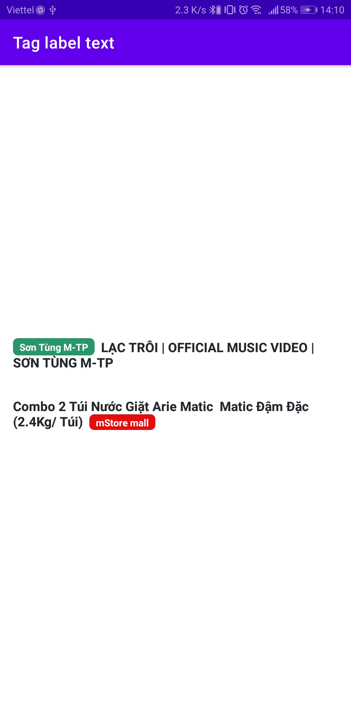

# Tag Label Text Android
## Make a tag of text for android with custom background of tag
<a href="Screenshot_20210118-141035.jpg" title="Click to see in full size"></a>&nbsp;


## Setup

Coppy 2 class **RoundBackgroundColorSpan.java** and **TagLabelText.java** into your widget 

## Usage
Use as normal TextView in android <br/>
```XML
<com.nextsolutions.taglabeltext.TagLabelText
            android:layout_width="match_parent"
            android:layout_height="wrap_content"
            android:layout_margin="16dp"
            android:gravity="center_vertical"
            android:text="Combo 2 Túi Nước Giặt Arie Matic  Matic Đậm Đặc (2.4Kg/ Túi)"
            android:textColor="#24282C"
            android:textSize="16sp"
            android:textStyle="bold"
            app:tagBold="true"
            app:tagFirst="false"
            app:tagMarginStart="8dp"
            app:tagPaddingEnd="8dp"
            app:tagPaddingStart="8dp"
            app:tagRadius="6dp"
            app:tagSize="12sp"
            app:tagText="mStore mall"
            app:tagTextBackgroundColor="#E40C0C"
            app:tagTextColor="#FFF" />
```

With binding. You can make some method biding in class TagLabelText like exammple. Remember remove tag **android** or **app** before attr binding to use binding. I don't know how that work :))

```
<com.nextsolutions.taglabeltext.TagLabelText
            ...
            text="@{`Combo 2 Túi Nước Giặt Arie Matic  Matic Đậm Đặc (2.4Kg/ Túi)`}"
            tagText="@{boolean logic ? `mStore mall` : ``}"
            app:tagTextBackgroundColor="#E40C0C"
            app:tagTextColor="#FFF" />
```
In programmatically
```XML
        TagLabelText tagLabelText = findViewById(R.id.tagLabel);
        tagLabelText.mSetText("LẠC TRÔI | OFFICIAL MUSIC VIDEO | SƠN TÙNG M-TP");
        tagLabelText.tagText = "Sơn Tùng M-TP";
        tagLabelText.setSpan();//apply properties of tagLabelText
```
## Properties TagLabelText
* `boolean: tagFirst` - Textview begin with tag if set true. Textview end with tag if false
* `boolean: tagBold` - Make style of tag text bold if set true. This property not working if textStyle of text is bold.
* `string: tagText` - Text of Tag
* `dimension: tagRadius` - Roud back ground tag
* `dimension: tagSize` - Size of tag text. Should equal or lower than text view
* `dimension: tagPaddingStart` - Padding Start of tag
* `dimension: tagPaddingEnd` - Padding End of tag
* `dimension: tagMarginStart` - MarginStart of tag
* `dimension: tagMarginEnd` - MarginStart of tag
* `color: tagTextColor` - Color of tag text
* `color: tagTextBackgroundColor` - Color backgroud of tag text

<br />

## Restrictions
* Size of tag should equal or lower than size of text.
<br />


## License
    The MIT License (MIT)
    
    Permission is hereby granted, free of charge, to any person obtaining a copy
    of this software and associated documentation files (the "Software"), to deal
    in the Software without restriction, including without limitation the rights
    to use, copy, modify, merge, publish, distribute, sublicense, and/or sell
    copies of the Software, and to permit persons to whom the Software is
    furnished to do so, subject to the following conditions:
    
    The above copyright notice and this permission notice shall be included in all
    copies or substantial portions of the Software.
    
    THE SOFTWARE IS PROVIDED "AS IS", WITHOUT WARRANTY OF ANY KIND, EXPRESS OR
    IMPLIED, INCLUDING BUT NOT LIMITED TO THE WARRANTIES OF MERCHANTABILITY,
    FITNESS FOR A PARTICULAR PURPOSE AND NONINFRINGEMENT. IN NO EVENT SHALL THE
    AUTHORS OR COPYRIGHT HOLDERS BE LIABLE FOR ANY CLAIM, DAMAGES OR OTHER
    LIABILITY, WHETHER IN AN ACTION OF CONTRACT, TORT OR OTHERWISE, ARISING FROM,
    OUT OF OR IN CONNECTION WITH THE SOFTWARE OR THE USE OR OTHER DEALINGS IN THE
    SOFTWARE.
